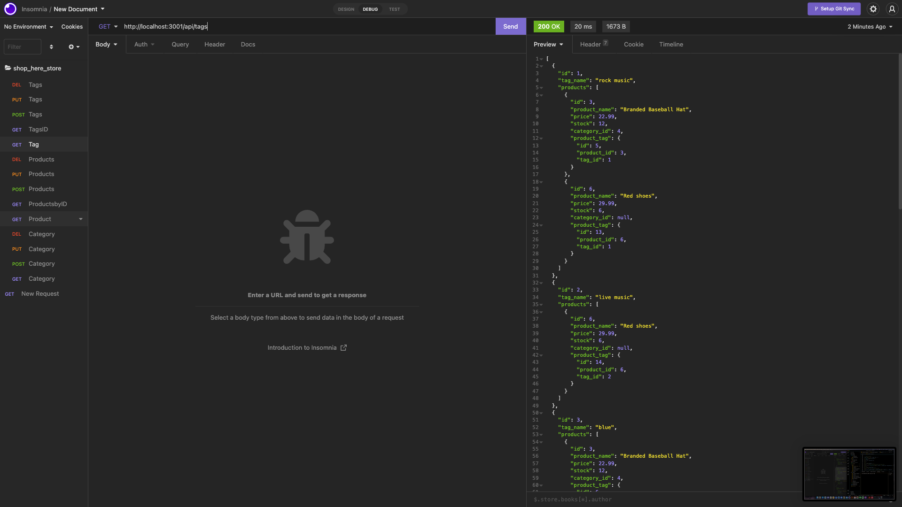
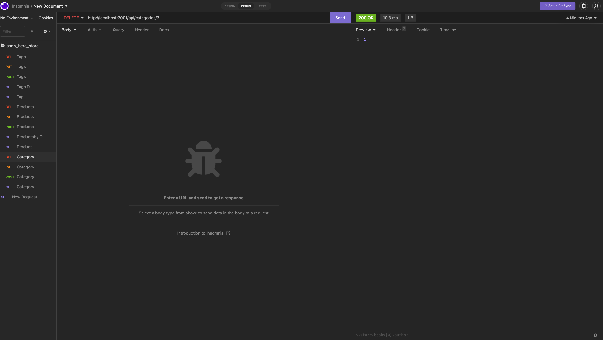
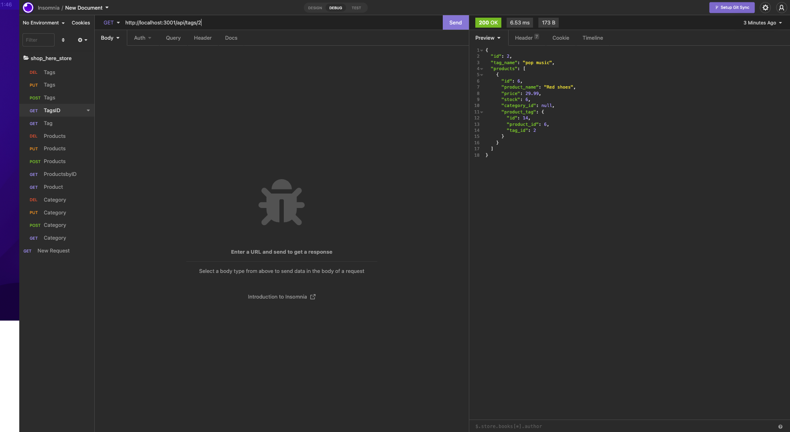

# E-commerce Backend shop_here

## Description

This is Backend of e-commerce built using Express and MySQL (sequelize).

## Usage and Demo

Click [here](https://drive.google.com/file/d/1G_R8ujXXmYSWfrIQapZ2mg5JOxEH0LWc/view) for video Demo.

Screen Shots

- 
- 
- 

## Table of Contents

- [Description](#description)
- [Usage and Demo](#usage-and-demo)
- [Installation](#installation)
- [License](#license)
- [Technology Used](#technology-used)
- [Questions](#questions)

## Installation

1. Create .env file to configure MySql Server
2. Install node modules using "npm i"
3. Source Scheme in your MySql shell Run "source db/schema.sql"
4. Seed tables "npm run seed"
5. To start "node server"

## License

Licensed under MIT License.

## Technology Used

- JavaScript
- NodeJs
- MySql
- Sequelize

## Questions

- GitHub: https://github.com/katochsenthal
- Email: katoch.senthal@gmail.com
